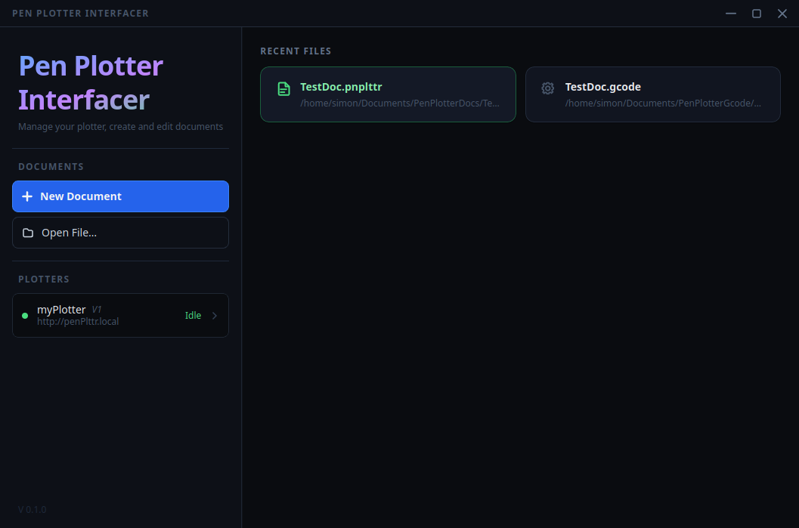
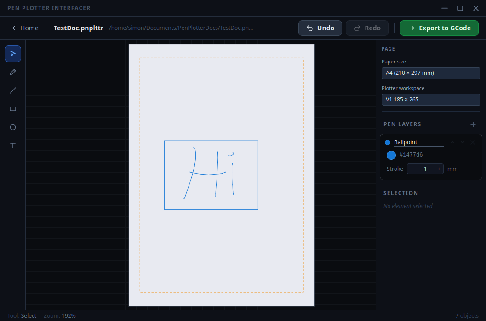
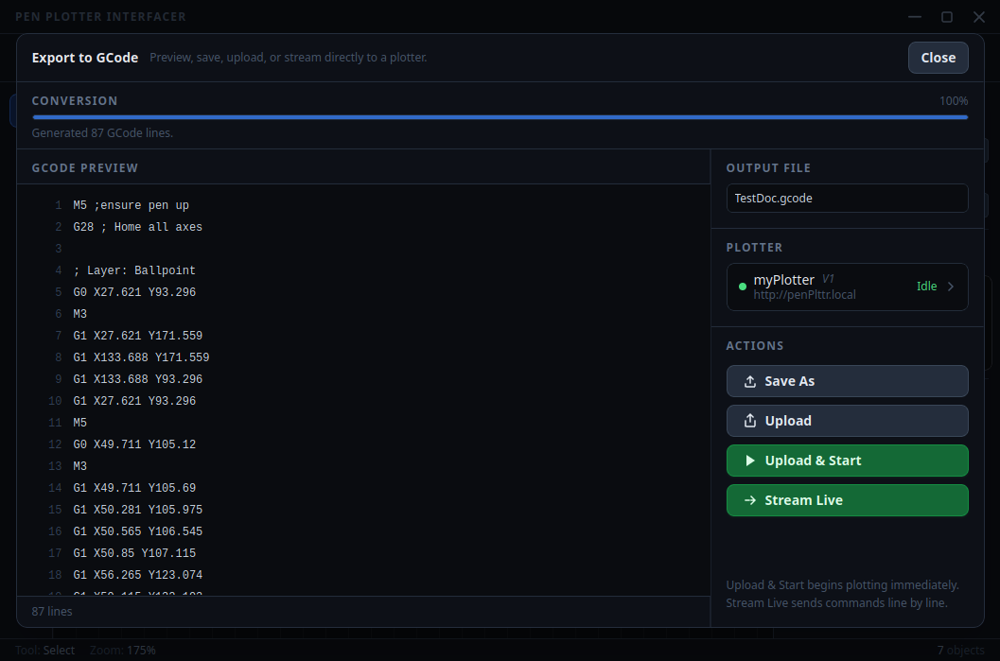
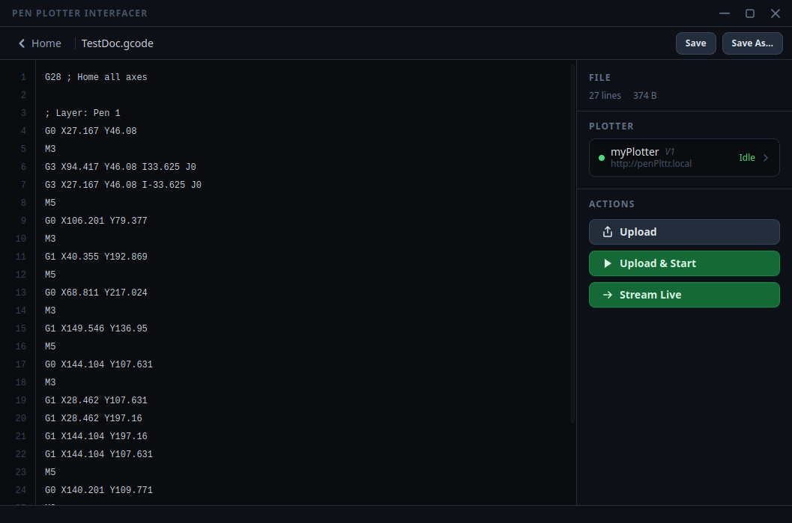
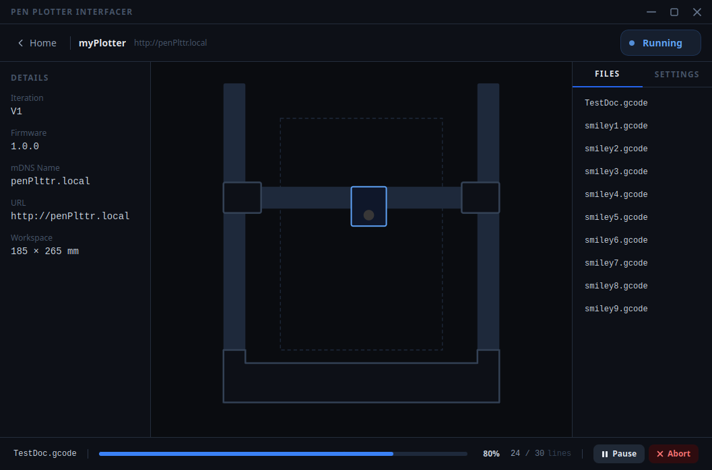

# Pen Plotter App

Eine Desktop-Anwendung zum Erstellen von Zeichnungen und zum Steuern eines Pen-Plotters. Entwickelt mit [Tauri 2](https://tauri.app/), React und TypeScript.



---

## Funktionen

- **Dokument-Editor** — Zeichnen mit mehreren Werkzeugen (Freihand, Linie, Rechteck, Kreis, Text), organisiert in Ebenen mit je eigener Stiftfarbe und -breite.
- **GCode-Export** — Wandelt Dokumente in GCode um, mit optimierter Strichreihenfolge (Greedy Nearest-Neighbour + 2-Opt), um die Leerfahrten des Stifts zu minimieren.
- **GCode-Editor** — Eingebauter Editor zum Anzeigen und Bearbeiten von GCode-Dateien vor dem Senden.
- **Plotter-Verwaltung** — Erkennt Plotter im lokalen Netzwerk automatisch per mDNS. Verbindung zum Gerät ermöglicht Echtzeit-Statusanzeige, Dateiverwaltung und Job-Steuerung (WebSocket).
- **Eigene Schriftarten** — Strichbasierte Fonts für das Textwerkzeug; benutzerdefinierte Schriften können direkt im Dokument eingebettet werden.
- **Zuletzt geöffnet** — Liste der zuletzt bearbeiteten `.pnplttr`-Dokumente auf dem Startbildschirm.

---

## Screenshots

### Dokument-Editor


### GCode-Export


### GCode-Editor


### Plotter-Steuerung


---

## Technologien

| Bereich | Technologie |
|---|---|
| Desktop-Shell | Tauri 2 (Rust) |
| UI | React 19, TypeScript, Tailwind CSS |
| Routing | React Router 7 |
| Build | Vite 7 |
| Geräteerkennung | mDNS (`mdns-sd` Crate) |
| Plotter-Kommunikation | HTTP REST + WebSocket |

---

## Projekt starten

### Voraussetzungen

- [Node.js](https://nodejs.org/) (LTS)
- [Rust](https://www.rust-lang.org/tools/install) (Stable Toolchain)
- Tauri-Systemabhängigkeiten — siehe [Tauri Voraussetzungen](https://v2.tauri.app/start/prerequisites/)

### Abhängigkeiten installieren

```bash
npm install
```

### Entwicklungsmodus starten

```bash
npm run tauri dev
```

### Produktions-Build erstellen

```bash
npm run tauri build
```

Das fertige Installationspaket liegt unter `src-tauri/target/release/bundle/`.

---

## Projektstruktur

```
src/
  features/
    document/       # Editor-Zustand, Element-Typen, GCode-Pipeline, Canvas-Rendering
    gcode-editor/   # Eigenständiger GCode-Viewer/Editor
    home/           # Startbildschirm (neues Dokument, letzte Dateien, Plotter-Liste)
    plotter/        # Geräteerkennung, HTTP-Client, WebSocket-Zustand, UI-Panels
  screens/          # Oberste Routen-Komponenten
  shared/           # Gemeinsame UI-Komponenten (TitleBar, ScreenHeader, …)
src-tauri/
  src/              # Rust-Backend (Datei-I/O, mDNS-Discovery, Tauri-Commands)
```

## Dokumentenformat

Dokumente werden als `.pnplttr`-Dateien gespeichert (JSON). Die Struktur sieht folgendermaßen aus:

```jsonc
{
  "meta": {
    "created": "2026-05-22T10:00:00Z", // Erstellungsdatum (ISO 8601)
    "doctype_version": 1               // Formatversion
  },
  "page": {
    "page_width": 210,        // Seitenbreite in mm (z. B. A4)
    "page_height": 297,       // Seitenhöhe in mm
    "workspace_width": 200,   // Nutzbare Plotterbreite in mm
    "workspace_height": 280   // Nutzbare Plotterhöhe in mm
  },
  "layers": [
    {
      "id": "layer-1",
      "name": "Kontur",
      "pen": { "color": "#000000", "width": 0.4 }, // Stiftfarbe + Breite in mm
      "elements": [
        { "id": "e1", "type": "Rect", "x": 10, "y": 10, "w": 80, "h": 50 },
        { "id": "e2", "type": "Circle", "cx": 50, "cy": 50, "r": 20 },
        { "id": "e3", "type": "Line", "x1": 0, "y1": 0, "x2": 100, "y2": 100 },
        { "id": "e4", "type": "Drawing", "points": [[10,20],[11,21],[12,22]] },
        { "id": "e5", "type": "Text", "x": 5, "y": 5, "w": 60, "h": 10,
          "text": "Hallo", "fontName": "default", "size": 8 }
      ]
    }
  ],
  // Optional: benutzerdefinierte Schriftarten eingebettet im Dokument
  "fonts": {
    "meinFont": {
      "name": "meinFont",
      "height": 10,
      "glyphs": {
        "A": { "width": 7, "paths": [ /* Strichpfade */ ] }
      }
    }
  }
}
```

Alle Koordinaten und Maße sind in **Millimetern** angegeben. Ein Element hat immer ein `type`-Feld, das seine Form bestimmt (`Rect`, `Circle`, `Line`, `Drawing`, `Text`).
